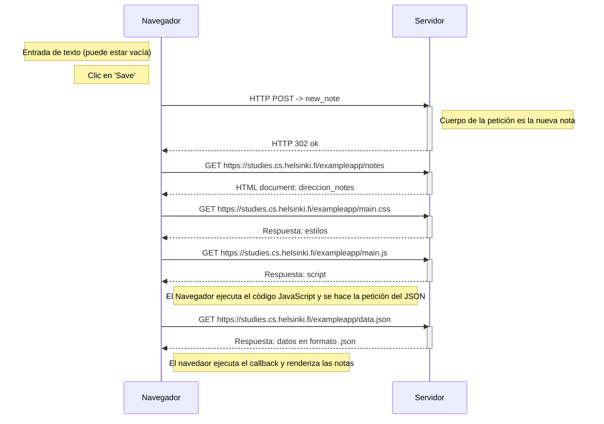

### part0.4

```mermaid
sequenceDiagram

  participant Navegador
  participant Servidor

  Note left of Navegador: Entrada de texto (puede estar vacía)
  Note left of Navegador: Clic en 'Save'

  Navegador->>Servidor: HTTP POST -> new_note
  activate Servidor
  Note right of Servidor: Cuerpo de la petición es la nueva nota
  Servidor-->>Navegador: HTTP 302 ok
  deactivate Servidor

  Navegador->>Servidor: GET https://studies.cs.helsinki.fi/exampleapp/notes
  activate Servidor
  Servidor-->>Navegador: HTML document: direccion_notes
  deactivate Servidor

  Navegador->>Servidor: GET https://studies.cs.helsinki.fi/exampleapp/main.css
  activate Servidor
  Servidor-->>Navegador: Respuesta: estilos
  deactivate Servidor

  Navegador->>Servidor: GET https://studies.cs.helsinki.fi/exampleapp/main.js
  activate Servidor
  Servidor-->>Navegador: Respuesta: script
  deactivate Servidor

  Note right of Navegador: El Navegador ejecuta el código JavaScript y se hace la petición del JSON

  Navegador->>Servidor: GET https://studies.cs.helsinki.fi/exampleapp/data.json
  activate Servidor
  Servidor-->>Navegador: Respuesta: datos en formato .json
  deactivate Servidor

  Note right of Navegador: El navedaor ejecuta el callback y renderiza las notas
```
