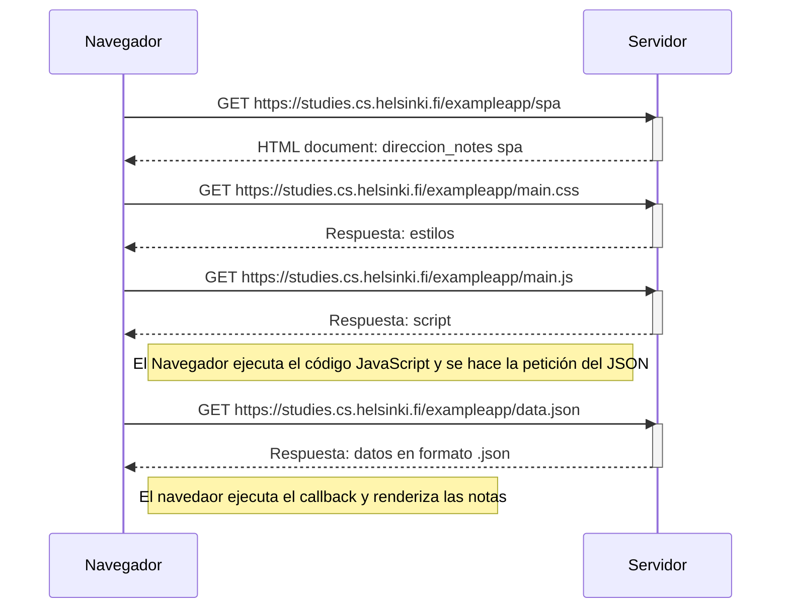

### part0.5

```mermaid
sequenceDiagram

  participant Navegador
  participant Servidor

  Navegador->>Servidor: GET https://studies.cs.helsinki.fi/exampleapp/spa
  activate Servidor
  Servidor-->>Navegador: HTML document: direccion_notes spa
  deactivate Servidor

  Navegador->>Servidor: GET https://studies.cs.helsinki.fi/exampleapp/main.css
  activate Servidor
  Servidor-->>Navegador: Respuesta: estilos
  deactivate Servidor

  Navegador->>Servidor: GET https://studies.cs.helsinki.fi/exampleapp/main.js
  activate Servidor
  Servidor-->>Navegador: Respuesta: script
  deactivate Servidor

  Note right of Navegador: El Navegador ejecuta el código JavaScript y se hace la petición del JSON

  Navegador->>Servidor: GET https://studies.cs.helsinki.fi/exampleapp/data.json
  activate Servidor
  Servidor-->>Navegador: Respuesta: datos en formato .json
  deactivate Servidor

  Note right of Navegador: El navedaor ejecuta el callback y renderiza las notas
```
