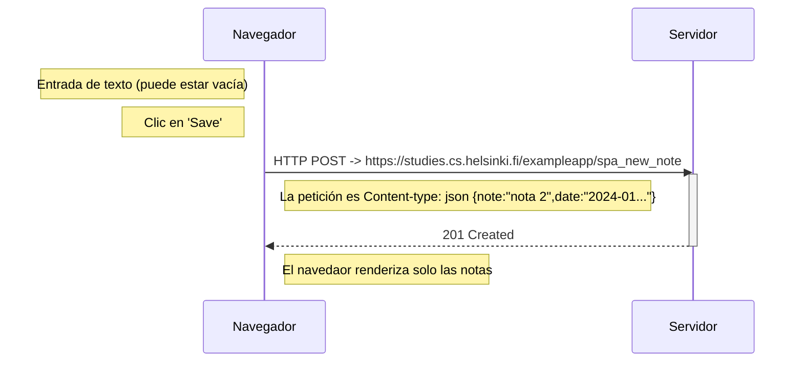

### part0.6

```mermaid
sequenceDiagram

  participant Navegador
  participant Servidor

  Note left of Navegador: Entrada de texto (puede estar vacía)
  Note left of Navegador: Clic en 'Save'

  Navegador->>Servidor: HTTP POST -> https://studies.cs.helsinki.fi/exampleapp/spa_new_note
  activate Servidor
  Note right of Navegador: La petición es Content-type: json {note:"nota 2",date:"2024-01..."}
  Servidor-->>Navegador: 201 Created
  deactivate Servidor

  Note right of Navegador: El navedaor renderiza solo las notas
```
